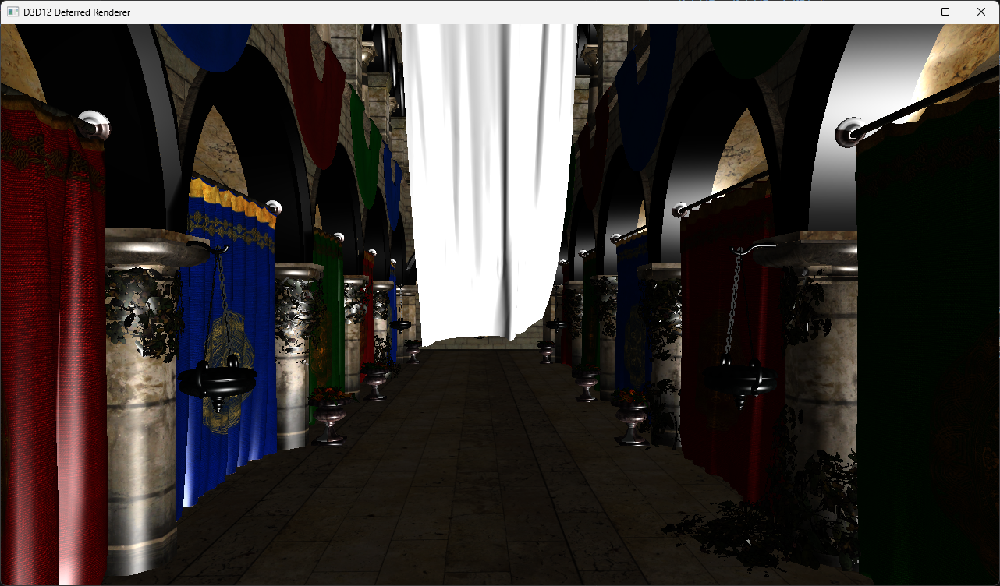
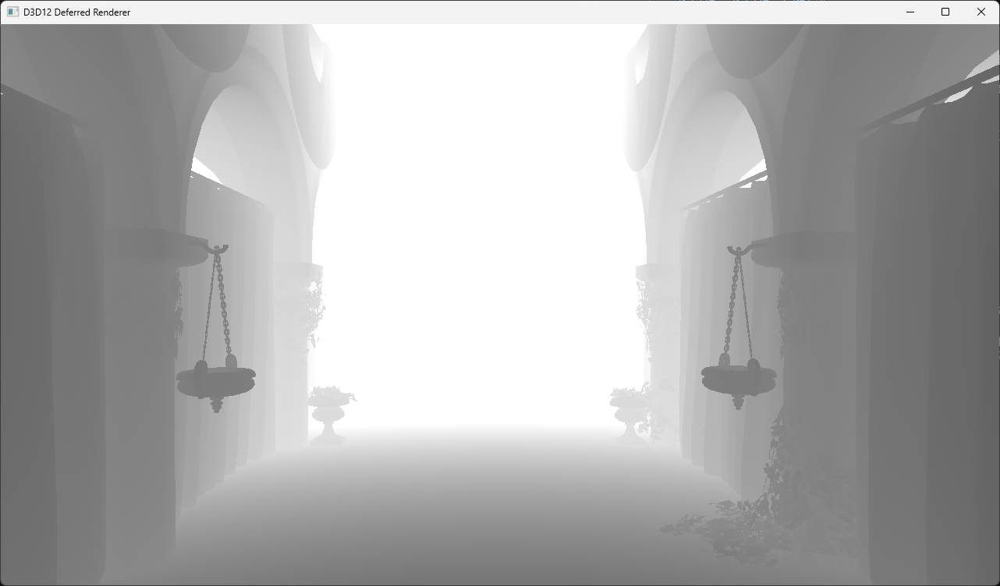
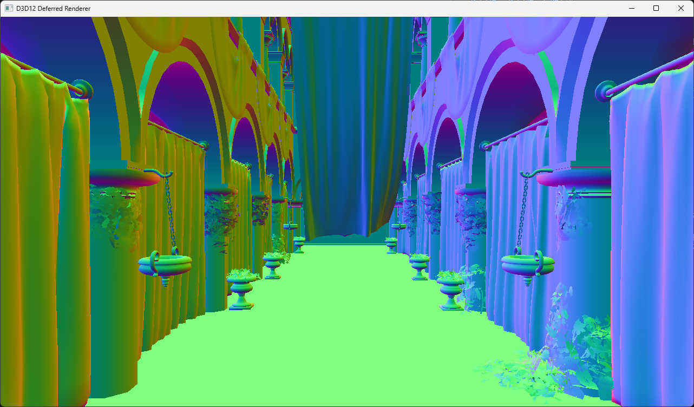
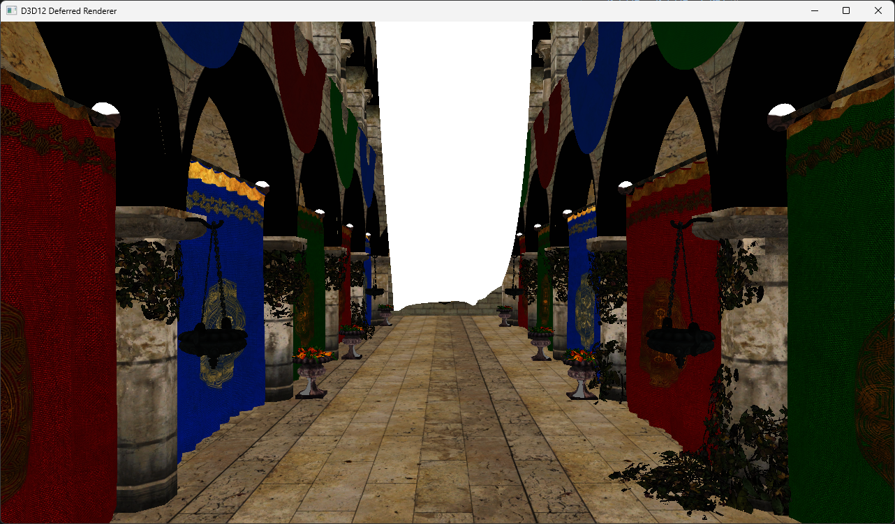

# Assignment: Foundations of Real-Time Rendering – Deferred Shading
根據[作業需求](Requirement.md)實作繪製 [Sponza 模型](./D3D12DeferredRenderer/D3D12DeferredRenderer/sponza/)

>[!Tip]
> 以 [DirectX-Graphics-Samples](https://github.com/microsoft/DirectX-Graphics-Samples) 的範例專案中的 [D3D12HelloTexture](https://github.com/microsoft/DirectX-Graphics-Samples/tree/master/Samples/Desktop/D3D12HelloWorld/src/HelloTexture) 為基礎做修改與擴充。
> 其餘皆為自己撰寫，並無套用任何既成之 D3D12 渲染框架。

>[!Tip]
> 整合 [Open Asset Import Library (Assimp)](https://github.com/assimp/assimp) 來讀取模型與貼圖。
> 若遇到透明貼圖，有在 Shader 中額外做 Alpha Clipping 處理。

## Results
### Final Color (最終合成之光照結果)

### Depth (深度圖)

### Normal (法線圖)

### Albedo (貼圖顏色)

## How to control?
- **WASD**: 第一人稱移動
- **滑鼠**: 第一人稱轉視角
  - 程式一執行後，滑鼠會隱藏進入遊戲狀態，直接轉即可
  - 為了方便實作，目前程式中僅使用 **Euler Angles** 實作旋轉
    - 未來有機會時，應該實作更精準且不會卡死的 **Quaternions** 方法
- **ESC**: 顯示滑鼠並暫時離開遊戲（此時視角不會轉）
  - 離開遊戲狀態時，可以按 **滑鼠右鍵** 拖曳視角
  - **滑鼠點畫面左鍵** 能夠回到遊戲狀態
- **Z**: 切換 Depth / Normal / Albedo / Final Color 狀態

>[!Note] 
> 互動的部分，有解耦獨立程式碼
> - `Camera.h` 及 `Camera.cpp` 用來處理攝影機相關
> - `InputManager.h` 用來處理輸入相關
> - 這些檔案目前在架構上皆為 Singleton 存在，因為目前不會有複數的情況
> - 也有整合進 `Win32Application.cpp` 中
> - 最後在 `D3D12HelloTexture.cpp` 實作 `HandleInput()` 處理輸入

## Shading Pipeline
主要分為兩階段
### Geometry Pass
- `GeometryPass.hlsl` 用來處理模型本身
  - 貼圖可能是透明，有做 Alpha Clipping 處理
- **G-buffer**
    - **Depth Buffer** (使用 D32\_FLOAT)
    - **Normal Buffer** (使用 R16G16B16A16\_FLOAT)
    - **Albedo Buffer** (使用 R8G8B8A8\_UNORM)

>[!Tip]
> 在 `D3D12HelloTexture.cpp` 的 `OnUpdate()` 中
> `XMMATRIX modelMatrix = XMMatrixScaling(0.1f, 0.1f, 0.1f);` 將模型 scale 縮小至 0.1 倍。
> 所以在計算 Depth (深度圖) 時，distance 有縮小才看得比較清楚。
> 在 `LightingPass.hlsl` 的 `PSLighting(...)` 中的 `float dist = length(cameraPos - worldPos) / 100.0f;`。

### Lighting Pass
- `LightingPass.hlsl` 用來處理光照渲染
- 使用一個全螢幕三角形 (Full-screen Triangle) 進行採樣渲染
- 從 G-buffer 中讀取資料並計算最終光照結果
- **演算法**：實作 **Blinn-Phong Shading**
- **光源設定**：
  - 類型：Directional Light (平行光)
  - 強度 (Intensity)：`(1.0, 1.0, 1.0, 1.0)`
  - 光照入射之**反方向** (Direction to Light)：`(-0.577f, -0.577f, -0.577f, 1.0f)`